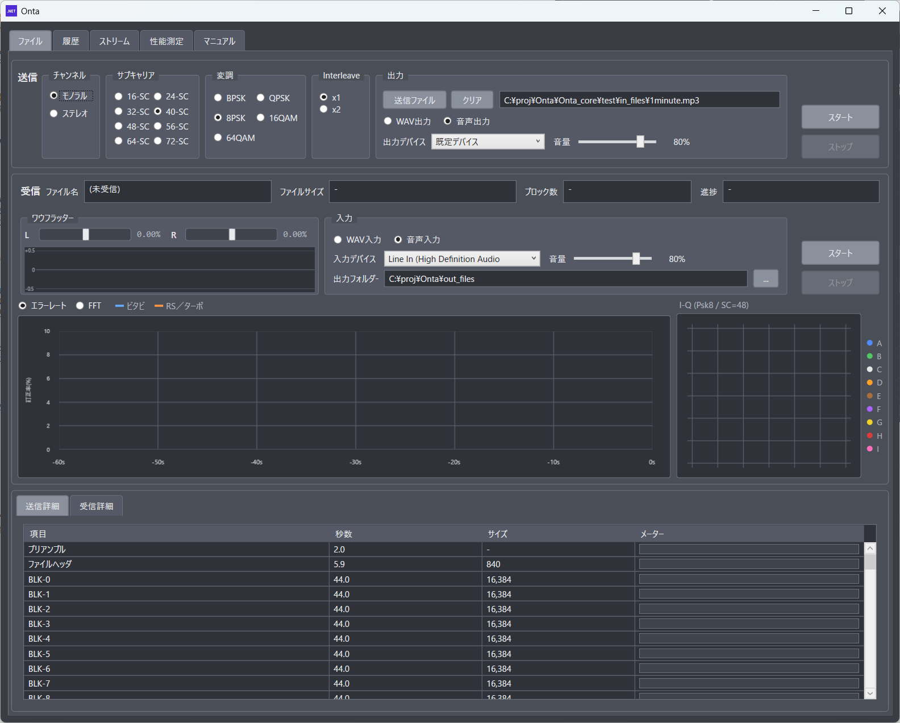
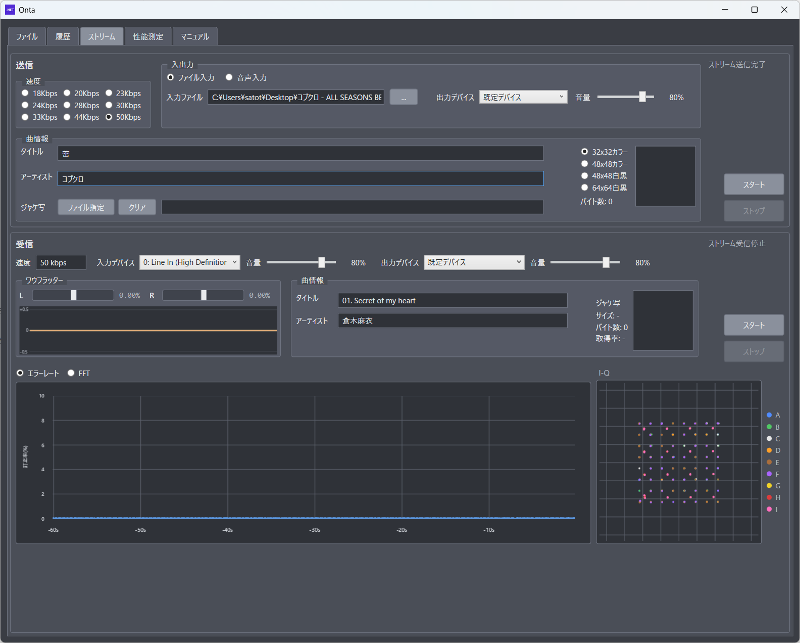
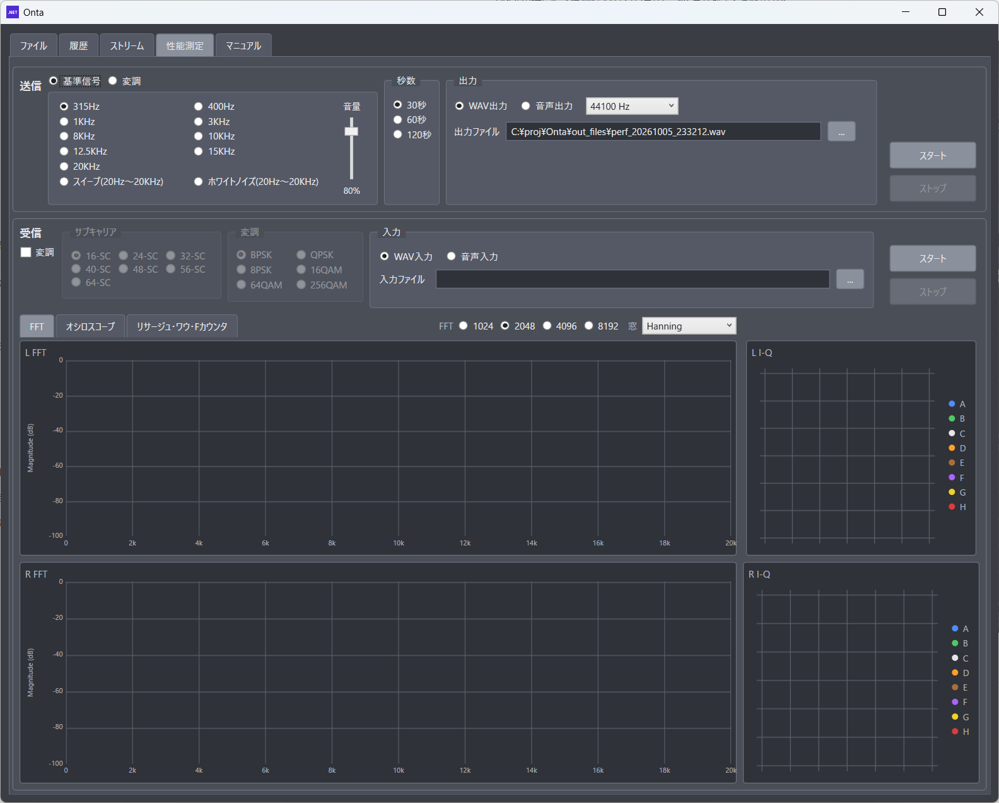
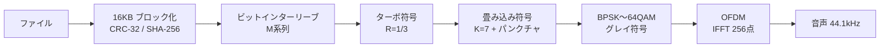

<!--
Qiita 投稿メモ
- タイトル案: カセットテープを USB メモリにする ― OFDM・QAM・ターボ符号で作った「音多（Onta）」
- タグ案: C# / WPF / 信号処理 / OFDM / 誤り訂正
- 画像はリポジトリ内のパスで書いています。Qiita ではエディタへドラッグ＆ドロップしてアップロードした URL に置き換えてください。
-->

# カセットテープを USB メモリにする ― OFDM・QAM・ターボ符号で作った「音多（Onta）」

## はじめに

50 年ほど前のパソコン黎明期、プログラムやデータはカセットテープに「音」として保存していました。カンサスシティスタンダード（KCS）などの規格があり、ゲームもカセットテープで売られていた時代です。

当時の転送速度は 600 ボー、およそ 60 バイト/秒。1 MB を記録するのに約 4.6 時間かかり、テープに少し傷があるだけで読めなくなりました。

**この「カセットテープにデータを記録する」を、現代の通信技術でやり直したらどこまで行けるのか。**

そう思って作ったのが「音多（Onta）」です。地デジや Wi-Fi、スマホで毎日お世話になっている OFDM・QAM・誤り訂正符号を、ワウフラッターだらけのアナログメディアに持ち込んでみました。

この記事では、前半で音多でできることを、後半で中身の技術を紹介します。



---

# 第1部 音多の紹介

## 音多とは

音多は、**ファイルを音声信号に変換して送り、その音声から元のファイルを復元する** Windows アプリです。

- 送信: ファイル → 音声（音声出力、または WAV ファイル）
- 受信: 音声（LINE 入力、または WAV ファイル） → ファイル

カセットデッキの LINE 入出力につなげば、テープが「ファイルの記録媒体」になります。要するに **USB メモリの代わりをカセットテープでやろう** というプロジェクトです。

カセットデッキが無くても、PC 2 台をオーディオケーブルでつなげば送受信を試せます。WAV ファイルだけでも動きます。

## 3 つのモード

| モード     | 内容                                                                                                                   |
| :--------- | :--------------------------------------------------------------------------------------------------------------------- |
| ファイル   | ファイルを丸ごと記録・復元する。音多の中心機能                                                                         |
| ストリーム | 音楽をデジタルデータ（Opus）の流れとして記録する。曲の途中から再生しても鳴り、曲名・アーティスト・ジャケ写も表示される |
| 性能測定   | デッキ・テープ・ケーブルの周波数特性、歪み、ワウフラッター、変調の限界を測る                                           |

### ファイル

送信側でサブキャリア数（16〜72 本）、変調方式（BPSK〜64QAM）、モノラル／ステレオを選びます。**本数と多値度を上げれば速く、下げれば強く** なります。

| 設定                                | 実効速度（ペイロード） | 1 MB の記録時間 |
| :---------------------------------- | ---------------------: | --------------: |
| SC-16 / BPSK / モノラル（最も堅い） |              約 40 B/s |       約 7 時間 |
| SC-48 / 16QAM / ステレオ            |            約 1.3 KB/s |        約 13 分 |
| SC-72 / 64QAM / ステレオ（最速）    |            約 2.9 KB/s |         約 6 分 |

※ 誤り訂正込みのデータ部だけで計算した値です。ヘッダーや無変調区間の分だけ実際は少し長くなります。

最速設定なら KCS のおよそ 50 倍、C-60 テープの片面（30 分）に約 5 MB 入る計算です。最も堅い設定は速度こそ昔と同程度ですが、誤り訂正の強さは桁違いです。

データは **16 KB ごとのブロック** に分けて記録します。各ブロックにはファイル全体とブロックそれぞれの SHA-256 ハッシュが入っているので、次のようなことができます。

- 読めなかったブロックだけ、テープを巻き戻して読み直す（受信は続けたまま、欠けたブロックを埋めていく）
- テープの途中から再生しても、そこからブロックを受け取る
- 何回かに分けて読んだ結果を履歴で突き合わせ、全ブロックがそろった時点でファイルとして取り出す

### ストリーム

音楽を Opus で圧縮し、パケットにして連続記録します。ファイルと違って先頭から読む必要はなく、**曲の途中から再生してもすぐに鳴ります**。

曲名・アーティスト・ジャケ写（PNG）も少しずつローテーションで記録しているので、再生していると画面に表示されます。速度は 18〜50 kbps の 9 段階です。



### 性能測定

録音の前に、カセットデッキの性能を確かめる画面です。

- 単音（315 Hz〜20 kHz）・スイープ・ホワイトノイズ・OFDM 変調波の出力
- FFT／オシロスコープ／リサージュ（ヘッドのアジマス調整用）
- 周波数カウンタ、歪み率（THD）、ワウフラッターメーター
- 変調波の I-Q 図（性能測定だけ 256QAM まで試せます）



## 画面のこだわり

受信中は FFT、誤り訂正の訂正率、I-Q コンスタレーション、ワウフラッターのグラフがリアルタイムで動きます。I-Q 図はサブキャリアのグループごとに色分けしているので、「高い周波数のキャリアほど点がにじむ」といったテープの特性が目で見えます。

## 動作環境・入手

- Windows 10 / 11（x64 / ARM64）
- .NET ランタイムのインストールは不要（自己完結型で配布）
- 画面は日本語／英語
- ライセンス: GPL v3
- リポジトリ: https://github.com/satotaka0409/Onta

:::note warn
MP3 や AAC などの不可逆圧縮で録音すると復元できません。また、PC のマイク端子は雑音除去が入るので、LINE 入力につないでください。
:::

---

# 第2部 使われている技術

ここからは中身の話です。ひとことで言うと「**地デジ・Wi-Fi と同じ道具立てを、カセットテープ向けに調整したもの**」です。

## 全体の流れ



受信はこの逆です。ポイントは、**復調から誤り訂正の最後まで「0/1 に決めない」（ソフト判定）で値を渡し続ける** ところです。

## OFDM ― 周波数を細かく分けて並列に送る

OFDM（直交周波数分割多重）は、たくさんの細いサブキャリアにデータを分けて同時に送る方式です。音多のパラメーターは次のとおりです。

| 項目                       | 値                                                 |
| :------------------------- | :------------------------------------------------- |
| サンプリングレート         | 44.1 kHz（変復調は固定）                           |
| FFT                        | 256 点                                             |
| サイクリックプレフィックス | データ部 16 サンプル／ヘッダー部 32 サンプル       |
| シンボルレート             | 約 162 シンボル/秒（256+16 サンプル）              |
| サブキャリア               | 16〜72 本（8 本で 1 グループ、A〜I の 9 グループ） |
| キャリア間隔               | 約 224 Hz（550 Hz〜約 16.6 kHz）                   |

### パイロットで「テープのくせ」を毎シンボル追いかける

8 本のグループごとに 2 本（CH2 / CH6）を既知の値を送るパイロットにしています。受信側はパイロットの振幅と位相を見て、次のことを行います。

- **AGC・等化**: テープの周波数特性やドロップアウトによるレベル変動を、グループ単位で補正
- **位相追従**: 速度ずれで毎シンボル一定量ずつ回る位相を、α-β フィルタで先回りして追う
- **シンボルタイミング追従**: パイロット位相の「周波数方向の傾き」から FFT 窓のずれを測り、シンボルごとに数サンプルずつ補正

### ステレオは「半分ずらす」

ステレオでは L と R に別々のデータを載せ、キャリア数を実質 2 倍にしています。ただし R のキャリアは L のちょうど中間（$f_R = f_L + \Delta f/2$）に置きます。テープのクロストークで L の信号が R に漏れても、同じ周波数に重ならないようにするためです。

### 高域は 1 段階手加減する

テープは高い周波数ほど出力が落ち、雑音が増えます。そこで約 11 kHz より上の変調を 1 段階下げます（64QAM→16QAM、16QAM→8PSK など）。全キャリアを同じ多値度にするより、全体の誤りが減ります。

## 多値変調 ― 1 回で何ビット送るか

各サブキャリアの点は、BPSK（1 ビット）から 64QAM（6 ビット）まで選べます。隣り合う点のビット違いが 1 つだけになるよう **グレイ符号** で並べているので、雑音で隣の点に間違えても誤りは 1 ビットで済みます。

受信側は「どの点か」を決めずに、各ビットが 0 / 1 である確からしさ（**LLR: 対数尤度比**）を出します。雑音の大きさは判定誤差から推定しています。

## 誤り訂正 ― 二重の符号で守る

ここがいちばん効いている部分です。データ部は **ターボ符号（外側）＋畳み込み符号（内側）** の連接符号です。

| 段       | 方式                                                        | 符号化率                                |
| :------- | :---------------------------------------------------------- | :-------------------------------------- |
| 外側     | ターボ符号（8 状態 RSC × 2 の並列連接、1024 バイト単位）    | 1/3                                     |
| 内側     | 畳み込み符号（拘束長 7、生成多項式 171 / 133（8 進））      | 1/2・2/3・3/4（変調に応じてパンクチャ） |
| ヘッダー | RS 符号（160, 128）＋畳み込み符号                           | 0.8 × 1/2                               |
| 検査     | CRC-32（ブロック・ヘッダー）、SHA-256（ブロック・ファイル） | ―                                       |

復号の流れは次のとおりです。

1. OFDM 復調でビットごとの LLR を出す
2. 畳み込み符号を **BCJR（Max-Log 近似）** で復号し、硬判定せずに「情報ビットの LLR」を出す
3. その LLR をそのままターボ符号の軟入力に渡し、**Max-Log-MAP で最大 12 回反復** 復号する
4. CRC-32 と SHA-256 で検査する

途中で 0/1 に決めてしまうと、「たぶん 0」と「絶対に 0」の区別が消えて訂正能力が大きく落ちます。最後まで確からしさを渡し続けるのが肝です。ターボ符号の SISO 復号は AVX2 で SIMD 化していて、リアルタイム受信に間に合わせています。

さらに、テープのドロップアウト（数十 ms のレベル低下）で誤りが 1 か所に固まらないよう、**31 ビット M 系列（$x^{31}+x^{28}+1$）で並べ替えるビットインターリーブ** を入れています。固まった誤りを散らすと、誤り訂正が「ばらばらの少数の誤り」として直せるようになります。

画面の訂正率グラフは、この訂正の途中で何ビット直したかを示しています。

## テープならではの問題との戦い

通信理論の教科書どおりにはいかない部分が、実はいちばん手間がかかりました。

### テープ速度のずれ（±4%）

録音したデッキと再生するデッキで、テープ速度は数 % ずれます。速度がずれると、周波数も時間も全部ずれます。

音多は各ヘッダーの手前に **無変調区間**（1 シンボル周期の繰り返し）を置いています。受信側はこの区間の周期を自己相関で小数点以下まで測り、公称周期（288 サンプル）との比から速度を求めます。その比で入力全体を **窓付き sinc 補間** でリサンプリングし、送信時の時間軸に戻してから復調します。

### ワウフラッター（〜0.5%）

テープ速度は一定でもなく、ゆらゆら揺れます（ワウフラッター）。上で書いたパイロットによるタイミング・位相追従に加えて、次のようにして吸収しています。

- 無変調区間と理想波形の相関が最大になるワウのパラメーターを探索し、逆写像のリサンプリングで補正
- ブロックのデータ全体（十数秒）を読み終えた位置から平均速度を求め、次のブロックの補正に使う

ただ、実際のテープのワウはきれいな正弦波ではないので、モデルで探すより毎シンボルの追従に任せた方がうまくいく場面も多く、このあたりは実機で何度も調整しました。

### その他の小ネタ

- **極性反転**: 録再の経路で波形が上下反転していても、パイロットの位相から検出して戻す
- **100 Hz ローカット**: DC やハムを除く
- **無音の詰め**: 送信 PC の再生バッファが切れて 10 ms 単位の無音が「挿入」されると、それ以降が 1 シンボル以上ずれて全滅します。短い無音を検出して詰めてから復調します

## ブロック構造と「読み直し」

ファイルは次の並びで記録します。

```text
[無変調 2秒] FH  BH-0 BD-0  BH-1 BD-1 ... (16ブロックごとに FH) ... FH
```

- **FH（ファイルヘッダー）**: ファイル名・サイズ・ブロック数・ファイル全体の SHA-256
- **BH（ブロックヘッダー）**: ブロック番号・サイズ・変調方式・ブロックとファイルの SHA-256
- **BD（ブロックデータ）**: 最大 16,384 バイト

ヘッダーは「絶対に落としたくない」ので、データ部の設定に関係なく 16 キャリア・QPSK・モノラル固定にし、RS 符号で守っています。

BH が独立しているので、FH を受けていなくても BH から受け始められます。どのファイルのブロックか分からないものは「不明ブロック」として保存しておき、あとで同じファイルハッシュの FH を受けた時点で取り込みます。

オプションの「繰り返し 2 回」では、2 回目をブロックの順番を入れ替え、変調も下げて送ります。同じ傷で両方を失いにくくするためです。

## ストリームの設計

ストリームは「途切れずに鳴ること」を優先した別設計です。

- **パケット**: ヘッダー 6 バイト＋曲情報 21 バイト＋音声データ 1,024 バイト。数百 ms ごとに独立して復調できる
- **音声**: Opus（CBR・20 ms フレーム）。パケットの送出時間より、運ぶ音声が少し長くなるようにフレーム数を決める
- **変調**: 48〜72 本・8PSK〜64QAM・ステレオ固定。誤り訂正は畳み込み符号だけ（遅延を小さくするため）
- **曲情報**: タイトル・アーティスト・ジャケ写を 16 バイトずつローテーションし、CRC-16 で検査してそろったものから表示

受信側では、テープ速度の差で再生バッファが溜まったり減ったりします。そこで充填量を目標 1.6 秒に保つよう、足りなければ Opus の PLC（パケット損失補償）で 20 ms 足し、多すぎれば 2 フレームをクロスフェードで 1 フレームに詰めます。

## 実装

| 項目       | 内容                                 |
| :--------- | :----------------------------------- |
| 言語・UI   | C# / .NET 8 / WPF                    |
| グラフ     | LiveCharts2                          |
| 音声入出力 | NAudio                               |
| 音声圧縮   | libopus（P/Invoke）                  |
| 配布       | ClickOnce（x64 / ARM64、自己完結型） |

変復調は画面とは別スレッドで動きます。進捗やグラフ用のデータはコアが共有メモリに書き込み、画面は 0.1 秒ごとにそれを読むだけにして、重い復号中も画面が固まらないようにしています。

## おわりに

「カセットテープにデータを入れる」という 50 年前の技術を、OFDM・多値 QAM・ターボ符号という現代の道具で作り直してみました。

アナログメディアの不安定さ（速度ずれ・ワウフラッター・ドロップアウト・高域の減衰）に対して、パイロットによる追従、リサンプリング、インターリーブ、連接符号と、通信技術がひとつずつ効いていくのは作っていて楽しいところでした。

地デジや Wi-Fi で使われている技術を、自分の手元の音で確かめられる教材としても面白いと思います。押し入れのカセットデッキを引っぱり出して、ぜひ遊んでみてください。
