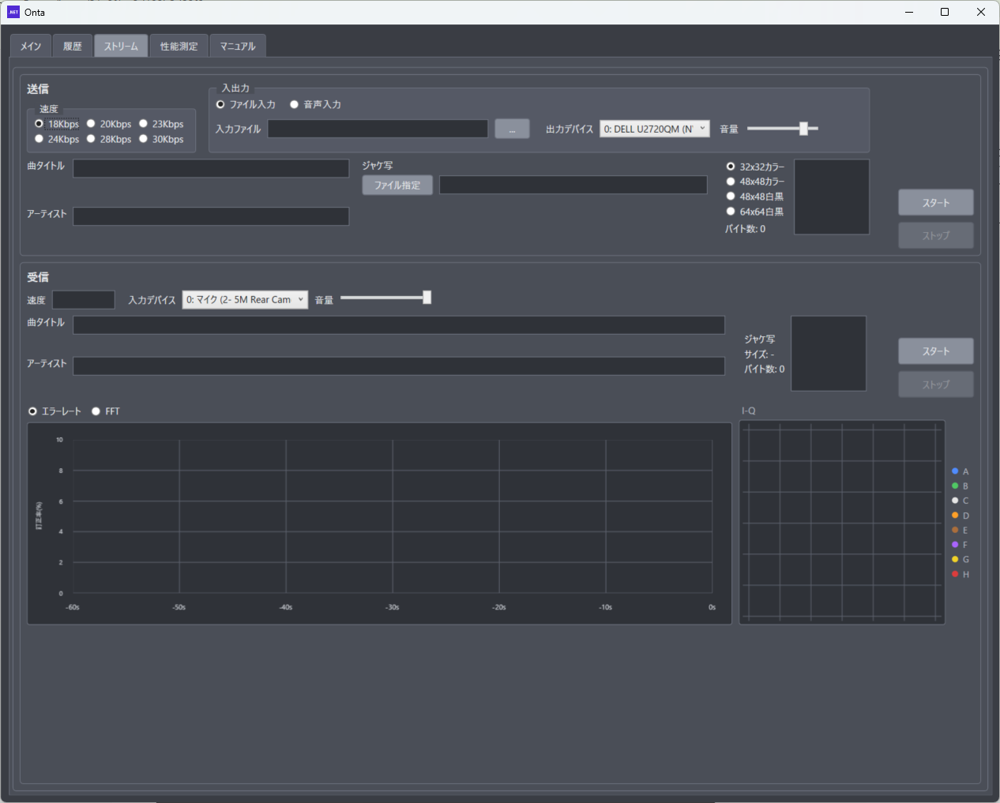

# 4. ストリーム画面の説明

## 4.1 ストリーム画面の目的

ストリーム画面は、音楽を Opus で圧縮したデジタルデータを、OFDM でカセットテープへ連続記録（ストリーム録音）し、テープから読み出す（ストリーム再生）ための画面です。

- メイン画面との違い
  - メイン画面: 1 つのファイルをブロック単位で記録し、受信側で元のファイルを復元します
  - ストリーム画面: 音声を途切れなく記録し続けます。**曲の途中から再生しても受信できます**
- 音声と一緒に「曲タイトル」「アーティスト」「ジャケ写」を繰り返し記録します。再生すると、これらが画面に表示されます
- チャネルは**ステレオ専用**です（L/R に別々のデータを載せます）
- 誤り訂正は畳み込み符号（ビタビ）のみです（RS・ターボ符号は使いません）
- 履歴（`Onta_history.bin`）には記録しません

実際の操作手順は [8. ストリーム画面の使い方](./08_ストリーム画面の使い方.md) を参照してください。

## 4.2 画面の全体構成

メイン画面と同様、上段が送信（録音）・下段が受信（再生）です。タブで上下を入れ替えません。

1. 送信パネル（速度・入出力・曲情報・ジャケ写）
2. 受信パネル（速度表示・入力設定・受信した曲情報とジャケ写）
3. グラフエリア（エラーレート / FFT の切替と I-Q グラフ）

画面サイズは 1280 × 1024（既定／最小）を想定しています。

## 4.3 送信パネル

送信パネルは、録音する音声の入力元、記録速度、曲情報を設定し、カセットデッキへ送出するエリアです。

### 4.3.1 速度

記録速度（Opus のビットレート）を 6 段階から選びます。速度によって、使うサブキャリア数と変調方式が決まります。

| 画面表示 | 変調                    | Opus ビットレート |
| :------- | :---------------------- | :---------------- |
| 18Kbps   | 48SC / 8PSK / ステレオ  | 18.4 kbps         |
| 20Kbps   | 56SC / 8PSK / ステレオ  | 20.4 kbps         |
| 23Kbps   | 64SC / 8PSK / ステレオ  | 23.2 kbps         |
| 24Kbps   | 48SC / 16QAM / ステレオ | 24.8 kbps         |
| 28Kbps   | 56SC / 16QAM / ステレオ | 28.4 kbps         |
| 30Kbps   | 64SC / 16QAM / ステレオ | 30.4 kbps         |

- 速度が速いほど音質は上がりますが、テープやデッキの状態に対して厳しくなります
  - 16QAM は 8PSK より多値なので、ノイズや歪みに弱くなります
  - 56SC / 64SC は 11kHz 以上の高域（グループ G / H）まで使います。G / H では変調を 1 段下げて（8PSK → QPSK、16QAM → 8PSK）信頼性を補っています
- 画面表示の数値は、Opus ビットレートの kbps 小数点以下を切り捨てた値です
- どの速度でも、テープへの送出は実時間より数 % 速く進むように設計されています（長時間録音しても送出が遅れません）
- 受信側では速度を選ぶ必要はありません（録音時の速度を自動で検出します）

### 4.3.2 入出力

- 入力元: ファイル入力 / 音声入力
  - ファイル入力: 音声ファイルを読み込んで録音します。ファイルの最後まで送ると自動で終了します
  - 音声入力: PC の録音デバイス（ライン入力など）の音をそのまま録音します。ストップを押すまで続きます
- 入力ファイル（ファイル入力時）
  - 「...」ボタンで音声ファイルを選びます。対応形式は WAV / FLAC / MP3 です
  - 表示欄へファイルをドラッグ＆ドロップしても選べます。WAV / FLAC / MP3 以外は受け付けません
- 入力デバイス・音量（音声入力時）
  - 録音に使うデバイスと入力音量を指定します
  - 取り込みは、選んだデバイスのサンプリング周波数で行います
- 出力デバイス・音量
  - カセットデッキの LINE 入力へつないだ音声出力デバイスと、出力音量を指定します
  - 再生は、選んだデバイスのサンプリング周波数で行います
  - ストリームの信号は 44100 Hz です。デバイスの周波数が違うときは、入出力の境界で変換します
  - ストリーム録音の出力は音声出力のみです（WAV ファイルへの出力はありません）

### 4.3.3 曲タイトル / アーティスト

- 記録する曲情報です。それぞれ最大 256 文字まで入力できます
- どちらも任意です。**空欄の項目は記録されません**（その分、ほかの曲情報が早く伝わります）

### 4.3.4 ジャケ写

- ファイル指定
  - 記録する画像ファイル（PNG / JPEG / BMP）を選びます。右側にプレビューが表示されます
- 画像形式
  - 画像は選んだサイズに縮小され、PNG に変換して記録されます

| 画像形式    | 解像度  | 色             |
| :---------- | :------ | :------------- |
| 32x32カラー | 32 × 32 | カラー         |
| 48x48カラー | 48 × 48 | カラー         |
| 48x48白黒   | 48 × 48 | グレースケール |
| 64x64白黒   | 64 × 64 | グレースケール |

- バイト数
  - 変換後（PNG）のバイト数です
  - 上限は 4096 バイトです。超えるとバイト数が赤字になり、「サイズオーバー」と表示されてスタートできません
- 曲情報は 1 パケットにつき 16 バイトずつ、タイトル → アーティスト → ジャケ写の順に交互に送られます。ジャケ写が大きいほど、受信側で全体がそろうまで時間がかかります（1024 バイトで約 47〜75 秒、4096 バイトで約 3〜5 分）。**1024 バイト程度に収めるのがおすすめ**です

### 4.3.5 ステータス表示・操作ボタン

- ステータス表示（右上）
  - 「送信中…」「停止要求」などの状態や、エラー内容を表示します
- スタート: 送出を開始します
- ストップ: 送出を停止します

### 4.3.6 利用時の注意（送信）

- 送信中は、ストップ以外の送信側の設定は操作できません
- 送信中は受信を開始できません（送信と受信は同時に実行できません）
- ジャケ写がサイズオーバーの場合はスタートできません
- ファイル入力で入力ファイルが未選択（または存在しない）の場合は、スタート直後に「失敗: 入力ファイルがありません。」と表示されて停止します

[スクリーンショット挿入: 送信パネル]

## 4.4 受信パネル

受信パネルは、カセットデッキの再生音を取り込み、記録されているストリームを受信するエリアです。

### 4.4.1 設定項目

- 入力デバイス・音量
  - カセットデッキの LINE 出力をつないだ録音デバイスと、入力音量を指定します（入力音量の初期値は 80%）
  - 取り込みは、選んだデバイスのサンプリング周波数で行います。ストリームの信号は 44100 Hz なので、違うときは入力の境界で変換します
  - 受信の入力は音声入力のみです（WAV ファイルからの受信はありません）
- 出力デバイス・音量
  - 受信して復号した音声（Opus）を再生するデバイスと、再生音量を指定します
  - 再生音量は受信中でも変更できます
  - パケットの到着の揺らぎを吸収するため、音はテープの再生より 0.5 秒前後遅れて出ます

### 4.4.2 表示項目

- 速度
  - 受信中のストリームから自動検出した速度（例: 18 kbps）を表示します。検出前は「-」です
- 曲タイトル / アーティスト
  - 受信した曲情報を表示します。各項目のデータがすべてそろった時点で表示されます
- ジャケ写
  - 受信した画像と、その解像度（サイズ）・バイト数を表示します
  - バイト数の下に取得率（例: 取得率: 45% (51/113)。取得済みブロック数／総ブロック数）を表示します。100% になると画像が表示されます。ジャケ写ブロックを 1 つも受信していないときは「-」です
  - 受信途中の画像や文字は表示しません。そろったデータが壊れていた場合は捨てて取得率が 0% に戻り、次の周回で取り直します
- ステータス表示（右上）
  - 「受信中…」「停止要求」などの状態や、エラー内容を表示します
  - 受信中は、受信できたパケット数・受信できなかったパケット数と、推定したテープの速度偏差（例: 速度 +0.52%。正なら録音時より速い）を表示します

テープの速度のずれには次のように対応します。

- カセットデッキの速度が録音時と違っていても（±4% 程度まで）、受信側で速度を推定して補正します
- 速度のゆっくりした変化や、ワウフラッター（細かな速度の揺れ）にも追従します
- 受信開始直後は速度を探すため、最初の数パケットは受信できないことがあります

曲情報の受信には次の特徴があります。

- 曲情報は繰り返し送られるので、曲の途中から再生しても、しばらく待てば表示されます
- 誤り（CRC-16 の不一致）があった部分は捨てられ、次に同じ部分が送られてきたときに取り込まれます
- 別のストリーム（別の録音）に切り替わると、表示中の曲情報はいったん消え、新しいストリームの曲情報を最初から取り込み直します

### 4.4.3 操作ボタン

- スタート: 受信を開始します
- ストップ: 受信を停止します

### 4.4.4 利用時の注意（受信）

- 受信中は送信を開始できません
- 入力音量は小さすぎても大きすぎても受信できません。I-Q やステータス表示を見ながら調整してください

> **現在のバージョンの制限**
> 受信した音声の WAV 出力は未実装です。再生は出力デバイス（LINE 出力）のみです。

[スクリーンショット挿入: 受信パネル]

## 4.5 グラフエリア

受信パネルの下部に、次のグラフが表示されます。受信中は受信している信号を、送信中は送出している信号を表示します。

### 4.5.1 エラーレート / FFT

ラジオボタンで表示を切り替えます。

- エラーレート（受信中のみ）
  - 誤り訂正（ビタビ）がパケットごとに訂正したビットの割合をグラフにしたものです（訂正後に残った誤りではありません）
  - 曲情報とストリームデータの部分を対象に、L/R 合わせた割合を表示します
  - ストリームは畳み込み符号のみなので、メイン画面のような RS / ターボの系列はありません
  - 値が高いほどテープの状態や音量が厳しいことを示します。値が上がっていくとパケットが受信できなくなります
- FFT
  - L（緑）/ R（オレンジ）のスペクトルを表示します（Hanning 窓）
  - 受信中は入力している信号、送信中は送出している信号のスペクトルです。選んだ速度のサブキャリア範囲（約 550Hz〜上限）に、L/R とも信号が出ていれば正常です

### 4.5.2 I-Q グラフ

- I: In-phase（横軸・コサイン波成分）、Q: Quadrature（縦軸・サイン波成分）の変調点を表示します
- 受信中は、直前に受信したパケット（曲情報とストリームデータの部分）の L/R 全サブキャリアの点を表示します。点が理想位置の周りに小さくまとまっているほど受信状態が良好です
- タイトルに変調方式を表示し、8PSK / 16QAM の枠が自動で切り替わります（受信中は検出した速度に合わせます）
- 点の色はサブキャリアグループ別です。右側に凡例が表示されます

| 速度                    | グループ構成    |
| :---------------------- | :-------------- |
| 18Kbps / 24Kbps（48SC） | A B C D E F     |
| 20Kbps / 28Kbps（56SC） | A B C D E F G   |
| 23Kbps / 30Kbps（64SC） | A B C D E F G H |

| GROUP | I-Qグラフの色 |
| :---: | :-----------: |
|   A   |      青       |
|   B   |      緑       |
|   C   |      白       |
|   D   |   オレンジ    |
|   E   |      茶       |
|   F   |      紫       |
|   G   |      黄       |
|   H   |      赤       |

- G / H グループは変調を 1 段下げて送っているため（8PSK→QPSK、16QAM→8PSK）、G（黄）/ H（赤）の点は他のグループと異なる位置に並びます

[スクリーンショット挿入: グラフエリア（FFT / I-Q）]

## 4.6 メイン画面との違い（要点）

| 項目                | メイン画面                          | ストリーム画面                                     |
| :------------------ | :---------------------------------- | :------------------------------------------------- |
| 目的                | ファイル送受信                      | 音楽の連続録音・再生                               |
| 記録するデータ      | 任意のファイル                      | Opus 音声 ＋ 曲情報・ジャケ写                      |
| 途中からの再生      | 不可（ブロック単位で照合）          | 可能                                               |
| チャネル            | モノラル / ステレオ                 | ステレオのみ                                       |
| サブキャリア / 変調 | 16〜48SC / BPSK〜64QAM を個別に選択 | 速度（6 段階）で自動決定（48〜64SC / 8PSK・16QAM） |
| 誤り訂正            | ビタビ ＋ RS / ターボ               | ビタビのみ                                         |
| 送信の出力          | WAV / 音声                          | 音声のみ                                           |
| 受信の入力          | WAV / 音声                          | 音声のみ                                           |
| 履歴                | 送受信を保存                        | 保存しない                                         |
