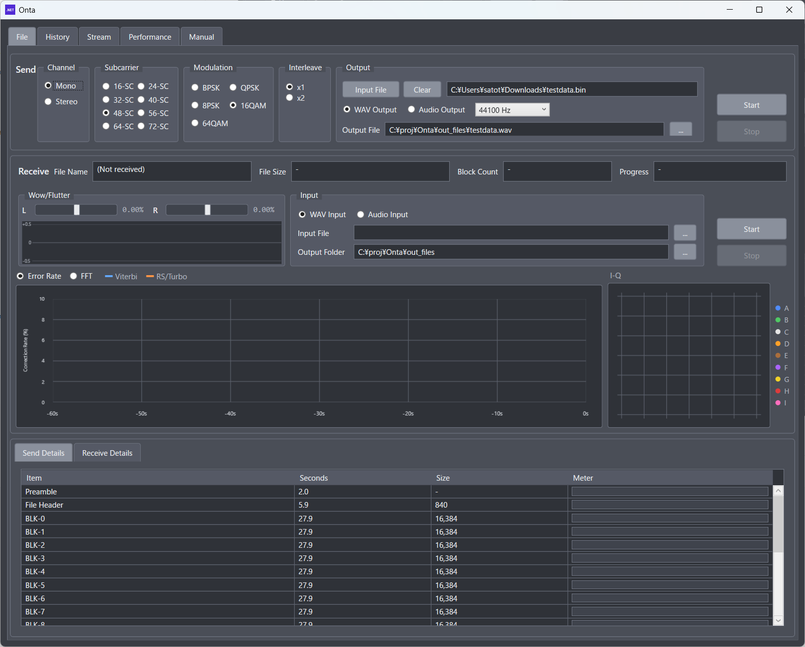
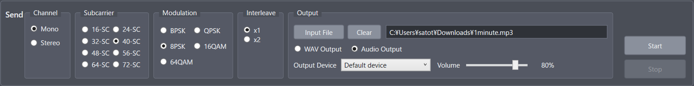
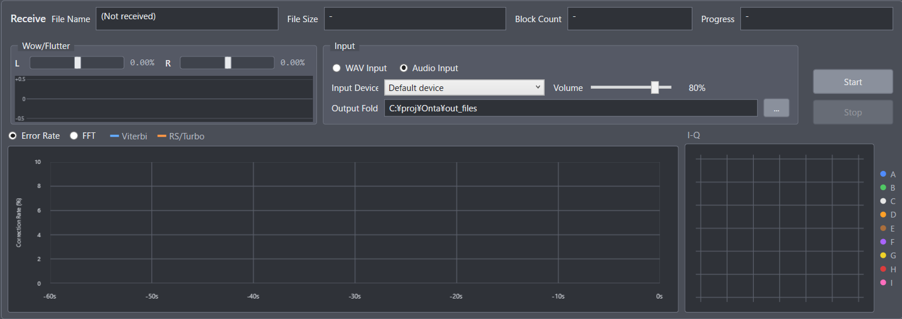
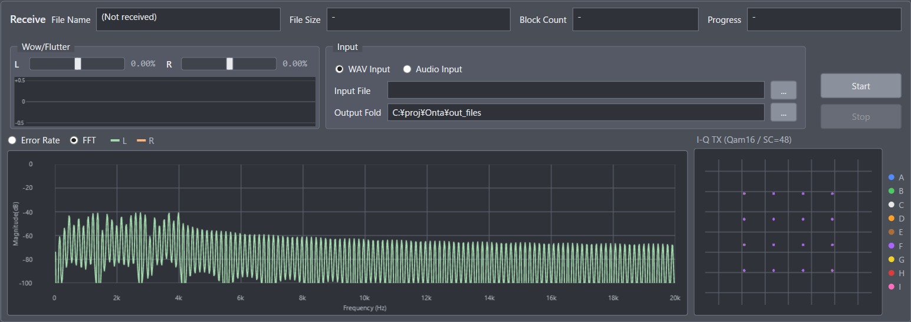
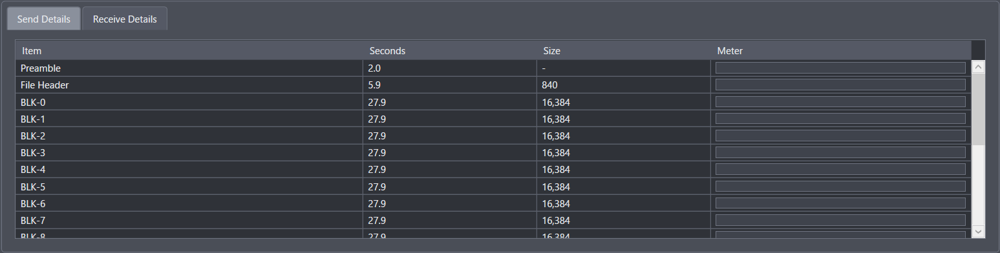
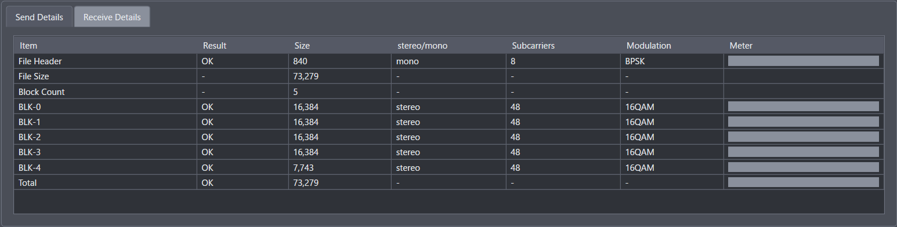

# 2. File Screen

## 2.1 Layout

The File screen (ファイル) has three areas:

1. Send panel
2. Receive panel
3. Detail tabs (Send Details / Receive Details)

## 2.2 Send Panel

The Send panel is where you set the send conditions and start or stop sending.

### 2.2.1 Settings

- Channel: Mono / Stereo
  - Stereo records different data on the left and right channels.
- Subcarrier: 16-SC, 24-SC, 32-SC, 40-SC, 48-SC, 56-SC, 64-SC, 72-SC
  - The number of subcarriers (tones) recorded at the same time, per channel. In stereo, the total is twice this number.
  - A larger value records more data at once.
  - However, the deck and tape limit how far you can go, so do not raise it carelessly.
  - As a guide, 24-SC is practical for a typical boombox and about 40-SC for a high-end cassette deck. 56-SC, 64-SC, and 72-SC depend heavily on your equipment; try them step by step.
  - 72-SC uses frequencies up to about 16.6 kHz. Unless your deck and tape have good high-frequency response, the I group (pink) breaks down first.
- Modulation: BPSK, QPSK, 8PSK, 16QAM, 64QAM
  - The modulation used on each subcarrier.
  - BPSK (1 bit) -> QPSK (2 bits) -> 8PSK (3 bits) -> 16QAM (4 bits) -> 64QAM (6 bits)
  - This is the number of bits carried per step. More bits record more data at once.
  - Again, the deck and tape set the limit.
  - As a guide, QPSK to 8PSK is the limit for a typical boombox and about 16QAM for a high-end cassette deck.
- Interleave: x1, x2
  - Whether to record the same data once, or twice at different times.
  - If the first copy has errors, the second copy can recover it.
  - The second copy automatically uses fewer subcarriers and a simpler modulation for reliability.
- Input and output
  - Input File (送信ファイル)
    - Selects the file to send.
    - You can also drag and drop a file onto the path box.
    - Clear (クリア), to the right of Input File, removes the selection. Only the path box is emptied; the WAV output destination stays. It cannot be pressed while sending.
    - If the output file is empty, a WAV output name is filled in from the dropped (or selected) file name.
    - Files larger than a few megabytes take a very long time.
  - Output mode (WAV Output / Audio Output)
    - WAV Output: creates a WAV file. This is much faster than audio output.
    - Audio Output: plays the signal as sound through a PC audio device.
  - Sampling rate (WAV output only)
    - To the right of Audio Output, choose 44100 Hz, 48000 Hz, or 96000 Hz.
    - The WAV file is created at the selected rate. The receiver reads the WAV at the rate recorded in the file.
    - This setting is hidden when Audio Output is selected.
    - The selected value is saved and restored the next time you start Onta.
  - Output Device and Volume
    - Selects the device for audio output. Audio output runs in real time, so it takes as long as the recording.
    - Playback uses the sampling rate of the selected device.
  - Output File (WAV output only)
    - The destination of the WAV file.

### 2.2.2 Buttons

- Start: starts sending.
- Stop: stops sending.

### 2.2.3 Notes

- You cannot start without selecting an input file.
- You cannot start if the selected input file does not exist.
- Enable either WAV Output or Audio Output.

## 2.3 Receive Panel

The Receive panel is where you set the receive conditions, start or stop receiving, and watch the receive status.

### 2.3.1 Status at the Top

- File Name: the name of the file being received
- File Size: the size of the file being received
- Block Count: the total number of blocks
- Progress: receive progress

### 2.3.2 Settings

- Input mode: WAV Input / Audio Input
  - WAV Input: reads a WAV file. This is much faster than audio input.
  - Audio Input: captures sound through a PC audio device. It runs in real time.
- WAV file (WAV input only)
  - Selects the WAV file to receive.
  - Receiving uses the sampling rate recorded in the file.
- Input Device and Volume (audio input only)
  - Selects the device used for audio input.
- Output Folder
  - The folder where a successfully received file is saved.
  - When receiving ends and all blocks are OK, the file is saved with its original file name. This also applies when you re-receive NG blocks and they complete the file together with the receive history.
  - If a file with the same name but different content already exists, it is not overwritten. A number is added instead, as in `name (2).ext`.

### 2.3.3 Visualizations

- Wow/Flutter meter (L/R)
  - A cassette deck has moving parts, so its speed always wobbles a little.
  - The wow/flutter meter shows this wobble.
- Error Rate
  - A graph of how many errors are being corrected.
  - Because errors are corrected, some errors do not mean the receive has failed.
  - Viterbi and RS/Turbo are the names of the two error-correction stages used together. Both are shown as separate lines.
- FFT
  - While sending, it shows the spectrum of the signal being sent.
  - While receiving, it shows the spectrum of the signal being received.
- I-Q
  - Plots the received points with I (in-phase, horizontal) and Q (quadrature, vertical).
  - The tighter the points gather around their ideal positions, the more accurately the signal is being received.
  - Points are colored by subcarrier group.
  - The groups used depend on the number of subcarriers selected when sending:

| Subcarrier | Groups            |
| :--------- | :---------------- |
| SC-16      | A B               |
| SC-24      | A B C             |
| SC-32      | A B C D           |
| SC-40      | A B C D E         |
| SC-48      | A B C D E F       |
| SC-56      | A B C D E F G     |
| SC-64      | A B C D E F G H   |
| SC-72      | A B C D E F G H I |

| Group | I-Q color |
| :---: | :-------: |
|   A   |   Blue    |
|   B   |   Green   |
|   C   |   White   |
|   D   |  Orange   |
|   E   |   Brown   |
|   F   |  Purple   |
|   G   |  Yellow   |
|   H   |    Red    |
|   I   |   Pink    |

### 2.3.4 Buttons

- Start: starts receiving.
- Stop: stops receiving.

- Error rate graph and I-Q constellation

  

- FFT graph and I-Q constellation

  

### 2.3.5 Notes

- You cannot start without an output folder.
- With WAV input, you cannot start if no WAV file is selected or the file does not exist.
- Selecting a WAV file does not start receiving. Always press Start.

## 2.4 Detail Tabs

Below the Receive panel there are two tabs.

### 2.4.1 Send Details

Shows the estimated time and size of each part and a progress meter for each.

### 2.4.2 Receive Details

Shows the result, size, channel, number of subcarriers, modulation, and progress of each part being received.

