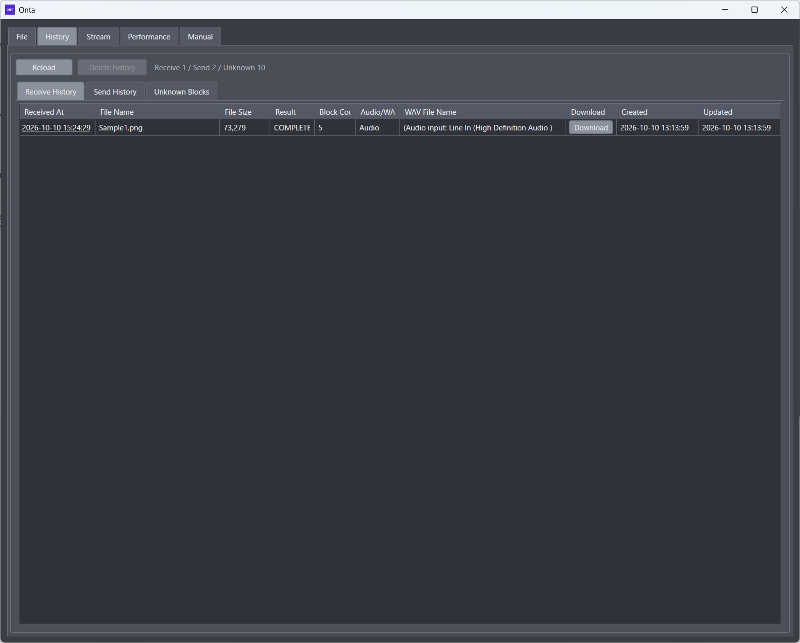
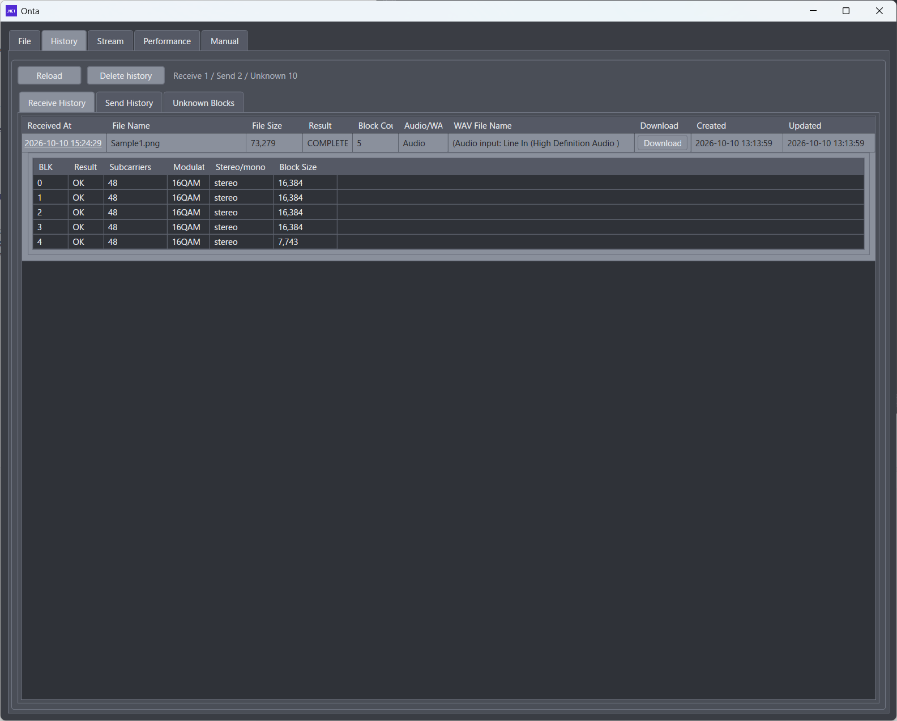
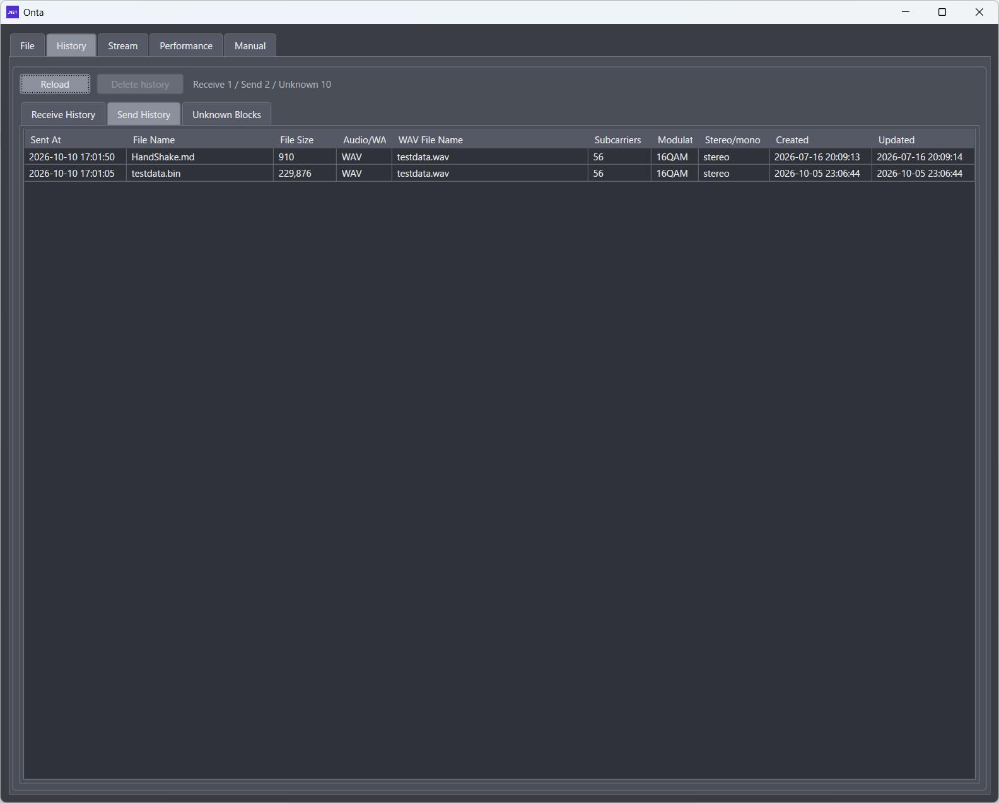
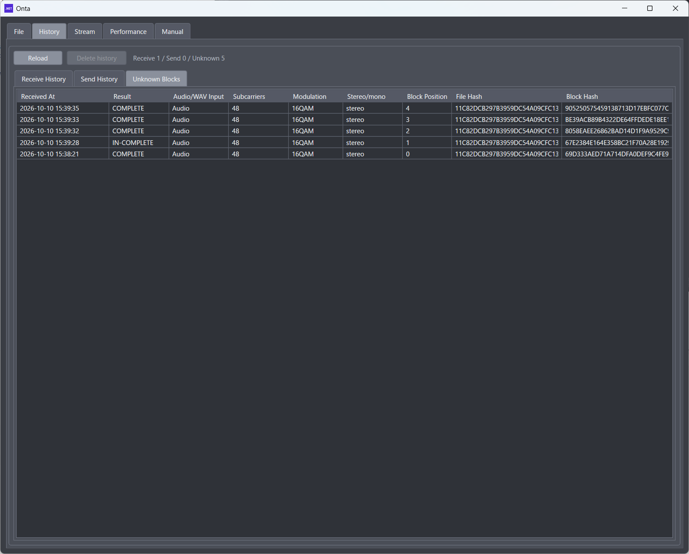

# 3. History Screen

## 3.1 Purpose

The History screen (履歴) lists past send and receive results.
Use it to check the settings you used before and to follow up on receive results.

## 3.2 Buttons at the Top

- Reload: reloads the history.
- Delete history: deletes the selected history entry.

Note: Deleted entries cannot be restored. Check before deleting.

## 3.3 Receive History Tab

### 3.3.1 Columns

- Received At
- File Name
- File Size
- Result
- Block Count
- Audio/WAV
- WAV File Name
- Created
- Updated

### 3.3.2 Operations

- Click Received At to open or close the block details.
- If blocks were received without the file header and the file is not in the receive history (orphan blocks), they do not appear here. They appear in the Unknown Blocks tab instead. When the file header of that file is received later, those blocks move into the details of the receive history.
- A Download button appears on rows whose file can be restored.

### 3.3.3 Block Details

Click Received At to show the per-block results of that file below the row. Click again to close them.

| Column      | Description                                                                                          |
| :---------- | :--------------------------------------------------------------------------------------------------- |
| BLK         | Block number, starting at 0. Listed in order                                                         |
| Result      | OK: the block's data was received / NG: the block header was read, but the data was damaged          |
| Subcarriers | Number of subcarriers used for the block's data (16 to 72)                                           |
| Modulation  | Modulation used for the block's data (BPSK / QPSK / 8PSK / 16QAM / 64QAM)                            |
| Stereo/mono | Channel of the block (stereo / mono)                                                                 |
| Block Size  | Size of the block in bytes. Up to 16,384; only the last block is shorter                             |

- Subcarriers, Modulation, and Stereo/mono show the values from the last block header read for that block. If a file sent with Interleave x2 is received through its second copy, the lowered settings of the second copy (such as 16 subcarriers) are shown.
- Only received blocks (OK and NG) are listed. Blocks whose header could not be read have no row, so some BLK numbers may be missing.
- When you receive the same file again, the details are merged into one entry. An NG block that is received as OK becomes OK, and an OK block never goes back to NG.
- When all blocks (0 to Block Count − 1) are OK, the result becomes COMPLETE and you can get the file with Download.
- Unknown blocks received without the file header move into these details when the file header of the same file is received later.

## 3.4 Send History Tab

### 3.4.1 Columns

- Sent At
- File Name
- File Size
- Audio/WAV
- WAV File Name
- Subcarriers
- Modulation
- Stereo/mono
- Created
- Updated

Use this tab to recheck the send conditions and compare past send settings.

## 3.5 Unknown Blocks Tab

### 3.5.1 Columns

- Received At
- Result
- Audio/WAV Input
- Subcarriers
- Modulation
- Stereo/mono
- Block Position
- File Hash
- Block Hash

This tab shows blocks that could not yet be matched to a file.

- File Hash and Block Hash are identifiers of the whole file and of the block. Blocks with the same File Hash belong to the same file.
- Result is COMPLETE if the block's data was received, and IN-COMPLETE if only the block header was read and the data was damaged.
- Unknown blocks accumulate each time you receive. Blocks with the same position and hashes are kept as one entry, with the newer received time.
- When the file header of that file is received, unknown blocks of the same file move to the receive history and disappear from this tab. Blocks that were already received are also removed.
- Delete history deletes only the selected unknown block.

## 3.6 Examples

1. When a receive fails, check the result and block count in the Receive History tab
2. Check the Unknown Blocks tab for patterns in the failures
3. Compare the subcarrier and modulation settings in the Send History tab
