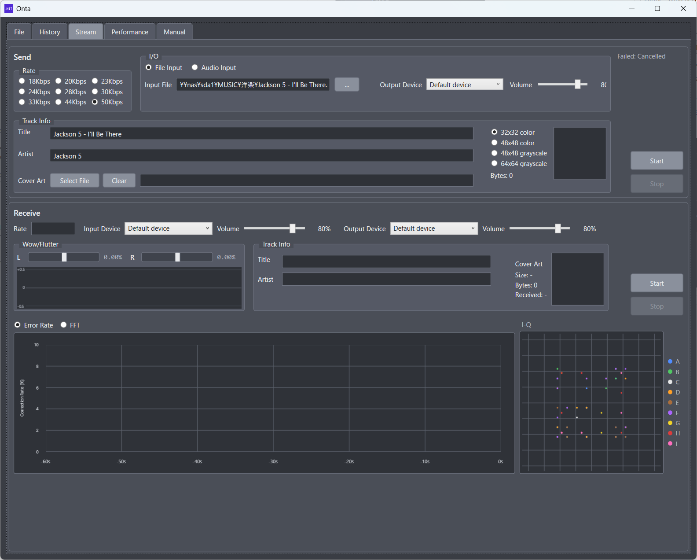
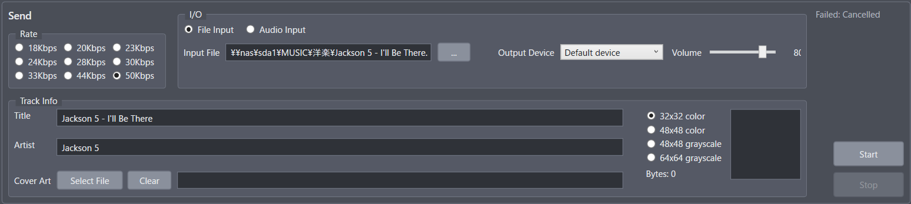
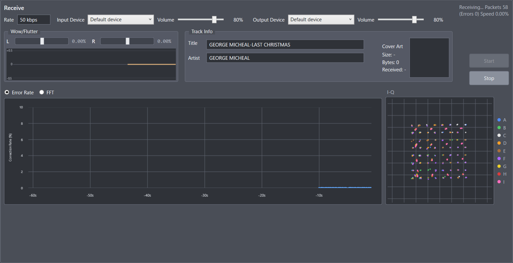

# 4. Stream Screen

## 4.1 Purpose

The Stream screen (ストリーム) records music on a cassette tape as a continuous stream of digital data (stream recording) and plays it back from the tape (stream playback).
The music is compressed with the Opus audio codec.

- Difference from the File screen
  - File screen: records one file in blocks; the receiver restores the original file
  - Stream screen: records sound continuously. **You can start playback in the middle of a song**
- The title, artist, and cover art are recorded repeatedly along with the sound and appear on screen during playback
- Streams are **stereo only**
- Nothing is saved to the history

For step-by-step instructions, see [8. Using the Stream Screen](./08_using_the_stream_screen.md).

## 4.2 Layout

As on the File screen, sending (recording) is at the top and receiving (playback) is below.

1. Send panel (rate, input/output, track info, cover art)
2. Receive panel (detected rate, input settings, received track info and cover art)
3. Graph area (Error Rate / FFT, and I-Q)

The screen is designed for 1280 × 1024. On a smaller display, the window fits within the screen and scroll bars let you reach the whole screen.

## 4.3 Send Panel

The Send panel sets the sound source, recording rate, and track information, and sends the signal to the cassette deck.

### 4.3.1 Rate

Choose the recording rate (the Opus audio bitrate) from nine levels. The rate also decides how many subcarriers and which modulation are used.

| Label  | Subcarriers / Modulation | Audio bitrate |
| :----- | :----------------------- | :------------ |
| 18Kbps | 48SC / 8PSK              | 18.4 kbps     |
| 20Kbps | 56SC / 8PSK              | 20.4 kbps     |
| 23Kbps | 64SC / 8PSK              | 23.2 kbps     |
| 24Kbps | 48SC / 16QAM             | 24.8 kbps     |
| 28Kbps | 56SC / 16QAM             | 28.4 kbps     |
| 30Kbps | 64SC / 16QAM             | 30.4 kbps     |
| 33Kbps | 72SC / 16QAM             | 33.2 kbps     |
| 44Kbps | 64SC / 64QAM             | 44.4 kbps     |
| 50Kbps | 72SC / 64QAM             | 50.4 kbps     |

- A higher rate gives better sound quality but needs a tape and deck in better condition
  - 16QAM is more sensitive to noise and distortion than 8PSK
  - 64QAM is even more sensitive. Use it only with a deck and tape in very good condition
  - 56SC, 64SC, and 72SC use high frequencies above 11 kHz. 72SC goes up to about 16.6 kHz; on a deck with weak treble, the I group (pink) breaks down first
- Recording takes about as long as the song itself, even with file input
- You do not need to choose a rate when receiving; the rate used for recording is detected automatically

### 4.3.2 Input and Output

- Source: File Input / Audio Input
  - File Input: reads an audio file and records it. Stops automatically at the end of the file
  - Audio Input: records the sound from a PC recording device (such as a line input) as it is. Continues until you press Stop
- Input File (file input only)
  - Select an audio file with the "..." button. Supported formats are WAV, FLAC, and MP3
  - You can also drag and drop a file onto the path box. Other formats are not accepted
- Input Device and Volume (audio input only)
  - The device and input volume used for recording
- Output Device and Volume
  - The audio output device connected to the cassette deck's LINE input, and the output volume
  - Stream recording outputs to an audio device only (there is no WAV output)

### 4.3.3 Title / Artist

- The track information to record. Each can be up to 256 characters
- Title, artist, and cover art are grouped in the Track Info frame
- When you select an input file (WAV / FLAC / MP3), the file name without the extension is entered as the title. You can edit it afterwards
- Both are optional. **Empty items are not recorded** (the other items reach the receiver sooner instead)

### 4.3.4 Cover Art

- Select File
  - Selects the image file (PNG / JPEG / BMP) to record. A preview appears on the right
- Clear
  - Removes the selected image and empties the path box and preview. Sends without cover art (cannot be pressed while sending)
- Image format
  - The image is shrunk to the selected size and converted to PNG

| Image format    | Resolution | Color     |
| :-------------- | :--------- | :-------- |
| 32x32 color     | 32 × 32    | Color     |
| 48x48 color     | 48 × 48    | Color     |
| 48x48 grayscale | 48 × 48    | Grayscale |
| 64x64 grayscale | 64 × 64    | Grayscale |

- Bytes
  - The size of the converted PNG
  - The limit is 4096 bytes. Above that, the size turns red, "Size over limit" appears, and you cannot start
- Track information is sent a little at a time with each packet, rotating through title, artist, and cover art. Cover art is sent more often than the title and artist
- The larger the cover art, the longer it takes for the receiver to get all of it (about 21 to 34 seconds for 1024 bytes, about 1.4 to 2.2 minutes for 4096 bytes). **About 1024 bytes is recommended**

### 4.3.5 Status and Buttons

- Status (top right)
  - Shows states such as "Transmitting..." and "Stop requested", and error messages
- Start: starts sending
- Stop: stops sending
  - With file input, an end-of-stream mark is added to the last packet when the end of the file is reached and when you press Stop. With audio input, it is added when you press Stop. The receiver shows "Ended" when it receives this mark
  - After you press Stop, the remaining sound and the end mark are recorded to tape before sending stops. This takes a few seconds

### 4.3.6 Notes (Sending)

- While sending, you can change the rate, output device, and input/output volume. The rate changes from the next packet. Switching the output device causes a short gap in the sound
- The source, input file, input device, and track information cannot be changed while sending
- You cannot start receiving while sending (sending and receiving cannot run at the same time)
- You cannot start if the cover art is over the size limit
- With file input, if no input file is selected (or it does not exist), "Failed: Input file was not found." appears right after you press Start, and sending stops

## 4.4 Receive Panel

The Receive panel captures the sound played by the cassette deck and receives the recorded stream.

### 4.4.1 Settings

- Input Device and Volume
  - The recording device connected to the cassette deck's LINE output, and the input volume (initially 80%)
  - Receiving uses audio input only (there is no WAV input)
- Output Device and Volume
  - The device that plays the received music, and the playback volume
  - The playback volume can be changed while receiving
  - About 1.6 seconds of sound is buffered before playback to absorb timing variations and missing packets. The sound comes out about 2 seconds after the tape plays it
  - Short gaps from packets that could not be received are filled smoothly, so you do not hear a sudden silence
  - Right after receiving starts, the first few seconds of a song may not play while Onta locks onto the tape speed

### 4.4.2 Display

Title, artist, and cover art are grouped in the Track Info frame, with the wow/flutter meter to their left.

- Rate
  - The rate detected from the stream being received (for example, 18 kbps). Shows "-" before it is detected
- Title / Artist
  - The received track information. Each item appears once all of its data has arrived
- Cover Art
  - The received image, its resolution (Size), and its size in bytes
  - Below the bytes, the progress is shown (for example, "Received: 45% (51/113)", the number of received pieces out of the total). The image appears at 100%. Shows "-" when no cover art data has arrived yet
  - Partially received images and text are not shown. If the completed data turns out to be damaged, it is discarded, the progress goes back to 0%, and it is collected again on the next round
- Wow/Flutter
  - The same L/R meter (center 0, with values) and time graph as on the File screen. The range is ±0.5% (values beyond that stop the bar at the end, but the number shows the actual value)
  - Shows the small, quick speed wobble of the tape, about every 0.1 seconds, for L and R. It does not include the overall speed difference shown as "Speed" in the status
  - Positive means faster than the reference, negative means slower. It is not updated for packets that could not be received or while in standby
- Status (top right)
  - Shows states such as "Receiving..." and "Stop requested", and error messages
  - While receiving, it shows the number of received packets, the number of packets that could not be received, and the estimated tape speed difference (for example, "Speed +0.52%"; positive means faster than when recorded)
  - When the sender has finished (the end mark was received), it shows "Ended ... Packets n (Errors m)". It returns to "Receiving..." when the next stream is received
  - If the input level stays low (below about −60 dBFS) for 0.5 seconds, the status becomes "Standby (low input level)" and Onta waits for a signal. The graphs are not updated during standby. Right after you press Start, it is also in standby until a signal arrives

Tape speed differences are handled as follows:

- Even if the deck runs at a different speed from when the tape was recorded (up to about ±4%), Onta estimates and corrects the speed
- It also follows slow speed changes and wow/flutter (small, quick speed wobble)
- Right after receiving starts, the first few packets may not be received while Onta searches for the speed

Tape dropouts (the sound getting weaker for tens of milliseconds) are handled as follows:

- The data is spread across time and frequency when recorded, so short dropouts can be recovered by error correction

Track information is received as follows:

- Because the track information is sent repeatedly, it appears after a while even if you start playback in the middle of a song
- Parts with errors are discarded and collected again the next time the same part is sent
- When the stream changes (to a different recording), the displayed track information is cleared and collected again from the start

### 4.4.3 Buttons

- Start: starts receiving
- Stop: stops receiving

### 4.4.4 Notes (Receiving)

- You cannot start sending while receiving
- The stream cannot be received if the input volume is too low or too high. Adjust it while watching the I-Q graph and the status

## 4.5 Graph Area

The graphs below the Receive panel show the signal being received while receiving, and the signal being sent while sending.

### 4.5.1 Error Rate / FFT

Switch between them with the radio buttons.

- Error Rate (while receiving only)
  - Shows how much error correction is needed for each packet
  - The higher the value, the harder the conditions (tape condition or volume). As it rises, packets start failing
- FFT
  - Shows the L (green) and R (orange) spectrum
  - If signal appears on both L and R across the subcarrier range of the selected rate (from about 550 Hz up), everything is normal

### 4.5.2 I-Q Graph

- Shows the received points with I (horizontal) and Q (vertical)
- While receiving, it shows the points of all subcarriers of the last received packet, for both L and R. The tighter the points gather around their ideal positions, the better the reception
- The title shows the modulation, and the frame switches automatically between 8PSK, 16QAM, and 64QAM (while receiving, it follows the detected rate)
- Points are colored by subcarrier group, with a legend on the right

| Rate                             | Groups            |
| :------------------------------- | :---------------- |
| 18Kbps / 24Kbps (48SC)           | A B C D E F       |
| 20Kbps / 28Kbps (56SC)           | A B C D E F G     |
| 23Kbps / 30Kbps / 44Kbps (64SC)  | A B C D E F G H   |
| 33Kbps / 50Kbps (72SC)           | A B C D E F G H I |

| Group | I-Q color |
| :---: | :-------: |
|   A   |   Blue    |
|   B   |   Green   |
|   C   |   White   |
|   D   |  Orange   |
|   E   |   Brown   |
|   F   |  Purple   |
|   G   |  Yellow   |
|   H   |    Red    |
|   I   |   Pink    |

- The high-frequency groups G, H, and I use a simpler modulation than the others for reliability, so the yellow, red, and pink points line up in different positions from the other groups

## 4.6 Comparison with the File Screen

| Item                      | File screen                                   | Stream screen                                          |
| :------------------------ | :-------------------------------------------- | :----------------------------------------------------- |
| Purpose                   | Sending and receiving files                   | Continuous recording and playback of music             |
| Recorded data             | Any file                                      | Opus audio, plus track info and cover art              |
| Playback from the middle  | No (matched block by block)                   | Yes                                                    |
| Channel                   | Mono / Stereo                                 | Stereo only                                            |
| Subcarriers / modulation  | 16 to 72 SC / BPSK to 64QAM, chosen separately | Decided by the rate (9 levels)                        |
| Send output               | WAV / Audio                                   | Audio only                                             |
| Receive input             | WAV / Audio                                   | Audio only                                             |
| History                   | Sends and receives are saved                  | Not saved                                              |
