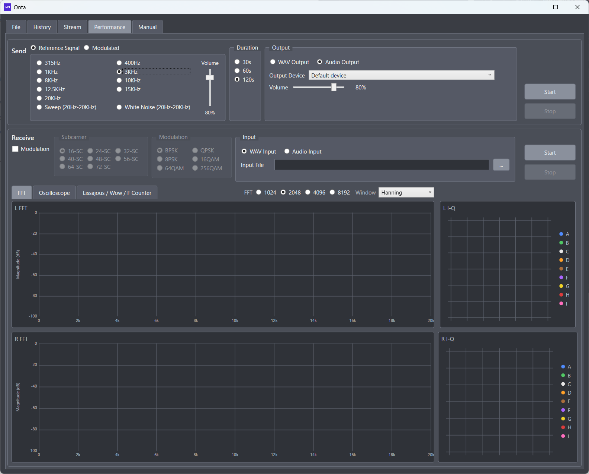
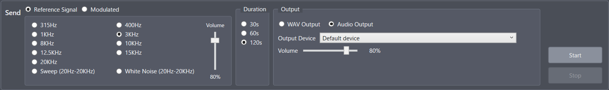
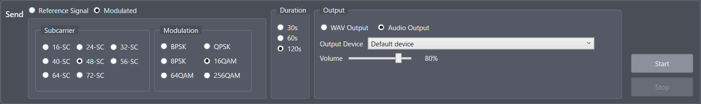
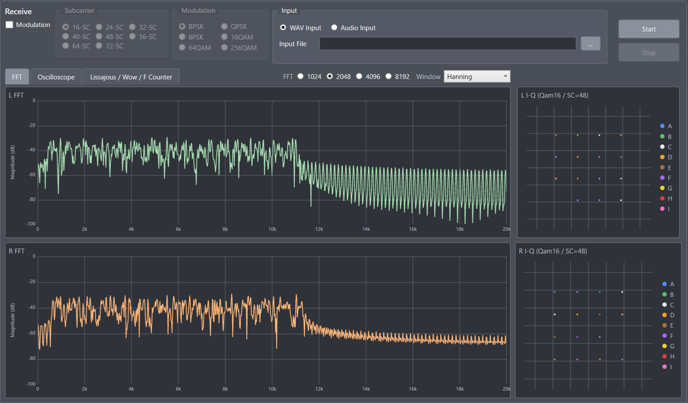
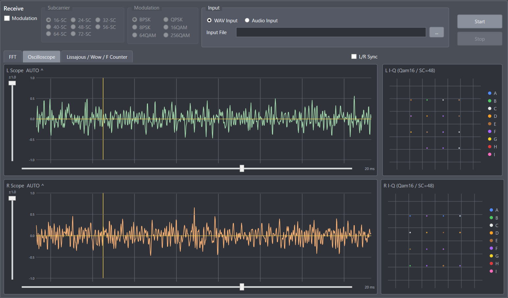
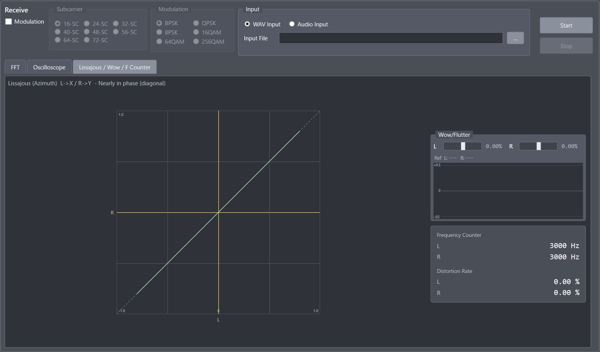
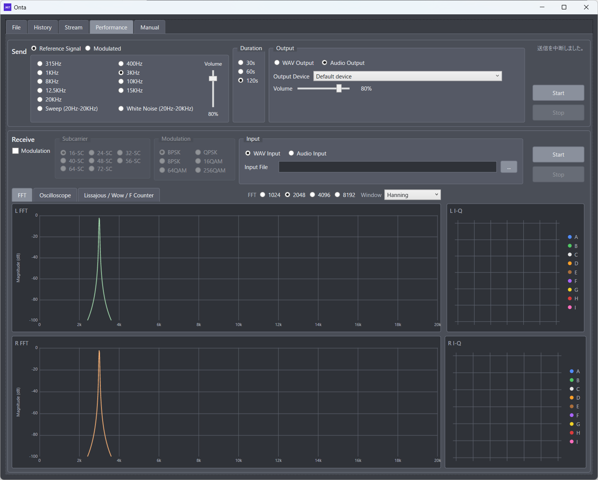

# 5. Performance Screen

## 5.1 Purpose

The Performance screen (性能測定) helps you find out how far your cassette deck, tape, and cables can go.
Separately from sending and receiving files, you can:

- Check frequency response, distortion, and wow/flutter with tones, sweeps, and noise
- Play the same kind of modulated signal Onta uses for data, to find the limits of subcarriers and modulation
- Watch signal quality in real time with the FFT, oscilloscope, Lissajous, and I-Q displays

Nothing is sent as a file or saved to the history. This screen is for measurement and adjustment only.

## 5.2 Layout

As on the File screen, sending is at the top and receiving is below.

1. Send panel (Reference Signal / Modulated tabs)
2. Receive panel (input settings and displays)
3. Display tabs (FFT / Oscilloscope / Lissajous / Wow / F Counter) and the I-Q graph

The screen is designed for 1280 × 1024. On a smaller display, the window fits within the screen and scroll bars let you reach the whole screen.

## 5.3 Send Panel

The Send panel sets the type, length, and destination of the test signal.

### 5.3.1 Reference Signal Tab

Outputs reference signals such as sine waves. This is the starting point for checking the frequency response, distortion, and wow of a cassette deck or amplifier.

- Tone frequency
  - 315Hz / 400Hz / 1KHz / 3KHz / 8KHz / 10KHz / 12.5KHz / 15KHz / 20KHz
  - Choose according to the band you want to check
- Sweep (20Hz-20KHz)
  - Moves the frequency continuously to see how far the response extends
- White Noise (20Hz-20KHz)
  - Outputs wide-band noise. It has no single frequency peak, so it is not suitable for measuring wow
- Level (vertical slider)
  - The output level of the sine wave. Keep it low enough that nothing distorts

### 5.3.2 Modulated Tab

Outputs the same kind of multi-carrier signal Onta uses for data.
You can try conditions equal to or beyond those of the File screen.

- Subcarrier: **16-SC to 72-SC** (same range as normal sending)
  - Larger values use a wider band, reaching the high-frequency groups (E/F, then G/H/I)
  - The top of 72-SC is about 16.6 kHz (I group: 14.9 to 16.6 kHz)
  - Use it to find the limits of your deck and tape
- Modulation: BPSK / QPSK / 8PSK / 16QAM / 64QAM, plus **256QAM** (Performance screen only)
  - More levels carry more data but are more sensitive to noise and distortion
- While sending on the Modulated tab, the I-Q graph is updated so you can see how the constellation holds up

| Subcarrier | Groups       |
| :--------- | :----------- |
| SC-16      | A B          |
| SC-24      | A B C        |
| SC-32      | A B C D      |
| SC-40      | A B C D E    |
| SC-48      | A B C D E F  |
| SC-56      | A to G       |
| SC-64      | A to H       |
| SC-72      | A to I       |

| Group | I-Q color |
| :---: | :-------: |
|   A   |   Blue    |
|   B   |   Green   |
|   C   |   White   |
|   D   |  Orange   |
|   E   |   Brown   |
|   F   |  Purple   |
|   G   |  Yellow   |
|   H   |    Red    |
|   I   |   Pink    |

### 5.3.3 Duration, Output, and Buttons

- Duration: 30s / 60s / 120s
  - The length of the measurement. Longer durations make wow and drift easier to see
- Output mode
  - WAV Output: creates a WAV file (fast)
  - Audio Output: plays through a PC audio device in real time (for loopback tests with real equipment)
- Sampling rate (WAV output only)
  - To the right of Audio Output, choose 44100 Hz, 48000 Hz, or 96000 Hz
  - The WAV file is created at the selected rate
  - This setting is hidden when Audio Output is selected. Playback uses the sampling rate of the selected device
  - The selected value is saved and restored the next time you start Onta
- Output File (WAV), Output Device and Volume (audio)
- Start / Stop

### 5.3.4 Notes (Sending)

- Enable either WAV Output or Audio Output.
- With audio output, you can change the following while sending, and the change takes effect immediately: Reference Signal / Modulated, tone frequency, sweep, white noise, level, number of subcarriers, and modulation. The I-Q graph is cleared when you switch.
  - Duration, output mode, output file, and output device cannot be changed while sending
  - The modulated signal is a roughly 4-second block of random data, repeated
  - The receive side does not follow these changes automatically. When you change the send settings, change the Receive panel to match
- When measuring with real equipment, check the connections (line or tape path) between the sending and receiving devices first.

## 5.4 Receive Panel

The Receive panel sets the input path and how the signal is displayed.

### 5.4.1 Input Settings

- Input mode: WAV Input / Audio Input
- WAV input: select the input file. Analysis uses the sampling rate recorded in the file
- Audio input: select the input device and volume. Capture and analysis use the sampling rate of the device
- Modulated (変調) check box: when ON, the signal is received as a modulated signal and the I-Q graph is shown. When OFF, it is received as a reference signal
- Subcarrier: 16 / 24 / 32 / 40 / 48 / 56 / 64 / 72-SC (only when Modulated is ON)
- Modulation: BPSK / QPSK / 8PSK / 16QAM / 64QAM / 256QAM (only when Modulated is ON)
  - The same choices as on the send side, set independently. Choose the same values as the signal being sent
  - These can be changed while receiving, including the Modulated check box, and take effect immediately (the I-Q graph and wow/flutter are reset)
- Start / Stop (independent of sending)

### 5.4.2 Display Tabs

The L/R display is switched with these tabs:

1. FFT
2. Oscilloscope
3. Lissajous / Wow / F Counter

The I-Q graph is to the right.
**When the Lissajous tab is selected, the I-Q graph is hidden** and the space is used for the wow, frequency, and distortion displays.

### 5.4.3 FFT Tab

- Shows the L and R spectrum (magnitude in dB)
- FFT size: 1024 / 2048 / 4096 / 8192
  - Larger sizes give finer frequency resolution but update more slowly
- Window: Hanning / Hamming / Blackman / Flat Top / Rectangular
  - Use Flat Top to read the level of a single tone accurately. Hanning or Hamming is fine for general viewing

### 5.4.4 Oscilloscope Tab

- Auto trigger on the rising edge (the yellow line marks the trigger point)
- Vertical slider: amplitude range (about ±0.1 to ±1.0), separately for L and R
- Horizontal slider: time span (about 1 to 100 ms), separately for L and R
- When L/R Sync is ON
  - The L range is copied to R, and from then on both channels' ranges move together

Useful for seeing waveform distortion, clipping, and loss of sync.

### 5.4.5 Lissajous / Wow / F Counter Tab

This display is for **azimuth adjustment** of stereo cassette decks.

- Lissajous
  - L on the X axis, R on the Y axis, in a ±1.0 square
  - When L and R are in phase, the figure lies on the diagonal (dashed guide). A phase difference turns it into an ellipse
  - A rough indication of the correlation is shown near the title
- Wow/Flutter
  - L/R bar meters side by side (center is 0, with values)
  - A time graph below (scrolling like Task Manager). The vertical axis is 0% in the center, +0.5% at the top, and −0.5% at the bottom
  - L is green, R is orange (same colors as the FFT)
  - Updated about every 0.2 seconds
- Frequency Counter
  - Shows L and R in 1 Hz steps
- Distortion Rate (THD)
  - Shows L and R in 0.01% steps

#### How Wow Is Measured

Onta locks onto the frequency the sender is expected to be using, closest to the received peak.

- Reference signal (tone): locks to the nearest tone in the tone list (315 Hz to 20 kHz)
- Modulated: locks to the L/R carrier frequencies of the selected subcarriers
  - Even when Modulated is ON, if the received signal is a single tone, the tone list is used
- Sweep / White Noise: the frequency moves or is spread too widely, so wow is not updated

The meter and time graph are not updated until the lock is established.

Below the wow meter, the reference frequency currently locked is shown for L and R (for example, "Ref  L: 3000.0 Hz (tone)   R: 3000.0 Hz (tone)"). "(carrier)" means a carrier of the modulated signal is used as the reference. Use this to check that the reference matches the tone being sent.

#### When There Is No Signal

While the input is silent (below −60 dBFS), the displays stop so that noise does not make the values jump. They resume when the signal returns.

- Wow/Flutter: the value of a silent channel stops. If both L and R are silent, the time graph also stops scrolling. It also stops while a signal is just starting or ending, because the values swing at those moments
- Lissajous: stops when both L and R are silent
- Frequency Counter and Distortion Rate: the value of a silent channel stops
- I-Q graph (receive): a silent channel keeps its last points. It also stops while a signal is just starting or ending, because the points scatter at those moments

### 5.4.6 I-Q Graph

- The frame switches to BPSK / QPSK / 8PSK / 16QAM / 64QAM / 256QAM to match the current modulation
- Modulated signals are received with the number of subcarriers and the modulation selected in the Receive panel. Match them to the send settings before you start receiving
- Shows the points of all subcarriers while receiving (and while sending a modulated signal)
- Points are colored by subcarrier group (A to I)

If the constellation spreads out, rotates, or breaks down in some groups, the band or modulation is too demanding.

## 5.5 Typical Uses

### 5.5.1 Checking the Band and Distortion of a Deck

1. Send: on the Reference Signal tab, play tones in turn, such as 1KHz, 10KHz, and 15KHz
2. Receive: loop back through audio input and check the peak position and level on the FFT, and the frequency counter and THD
3. If needed, check the waveform for distortion on the oscilloscope

### 5.5.2 Adjusting the Azimuth

1. Send: play a mid-to-high tone (for example, 8KHz or 10KHz) in stereo
2. Receive: open the Lissajous / Wow / F Counter tab
3. Adjust the deck's azimuth so that the Lissajous figure gets close to the diagonal
4. Watch the wow, frequency, and THD at the same time

### 5.5.3 Finding the Modulation Limit

1. Send: on the Modulated tab, raise the subcarriers and modulation step by step (for example, 24-SC QPSK, then 32-SC 16QAM, and so on)
2. Receive: watch the I-Q and FFT displays and find the highest setting at which the points stay tight
3. 56/64/72-SC are for decks with a wide frequency range. Check that the points stay tight here before using them for file transfer. 256QAM is an extended setting for measurement only and is not used for file transfer

## 5.6 Comparison with the File Screen

| Item        | File screen                         | Performance screen                          |
| :---------- | :---------------------------------- | :------------------------------------------ |
| Purpose     | Sending and receiving files         | Measuring signal quality and limits         |
| Subcarriers | 16 to 72                            | 16 to 72                                    |
| Modulation  | BPSK to 64QAM (including 8PSK)      | BPSK to 64QAM, plus 256QAM                  |
| Error rate  | Yes                                 | No (FFT, oscilloscope, Lissajous instead)   |
| History     | Sends and receives are saved        | Not saved                                   |

## 5.7 Notes

- Sending and receiving are started separately. For a loopback test, start both.
- The wow display stops during a sweep or white noise. This is expected.
- Measurement results are not saved in the history. Note the conditions and findings yourself.
- Some settings are saved and may be restored the next time you start Onta.

