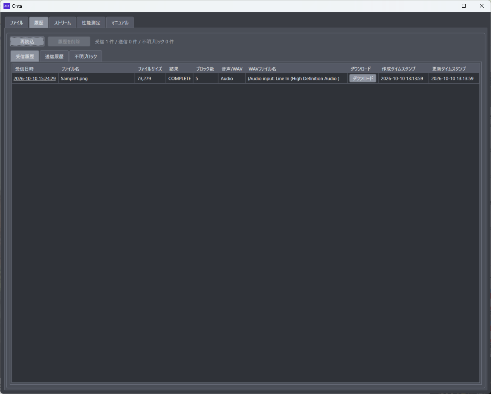
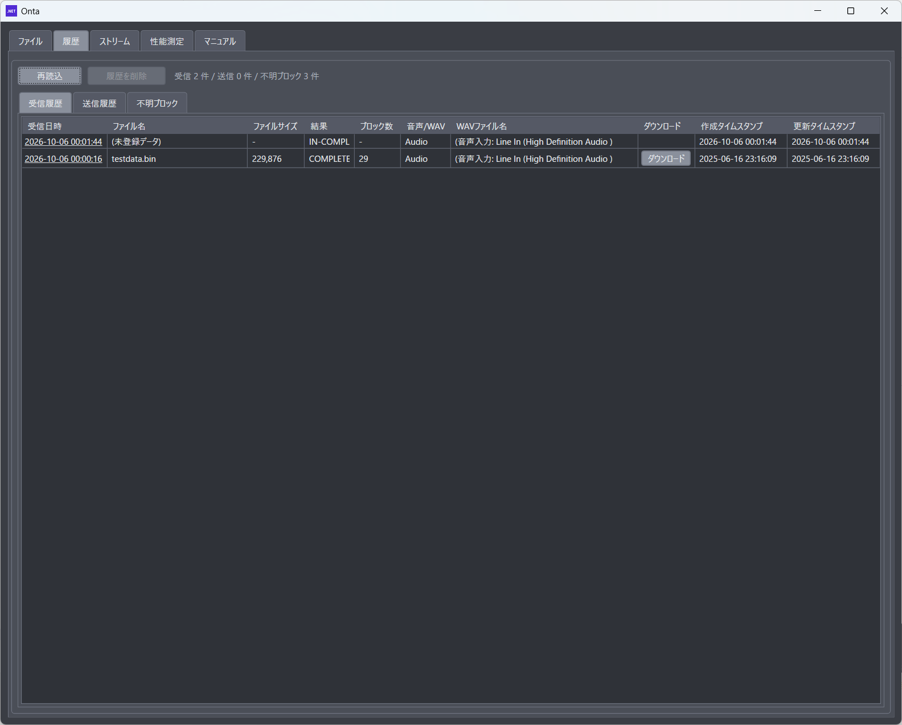
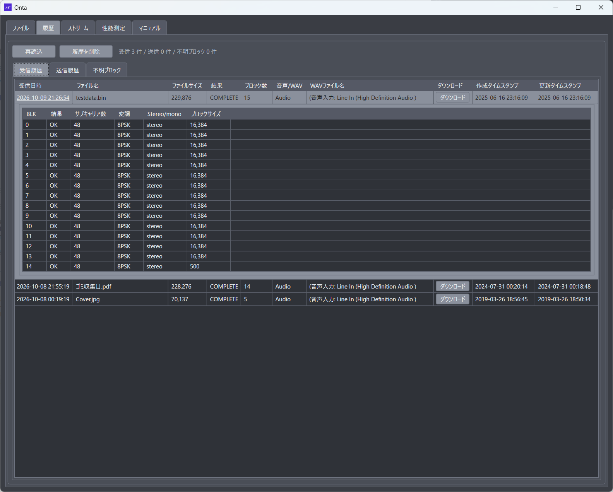
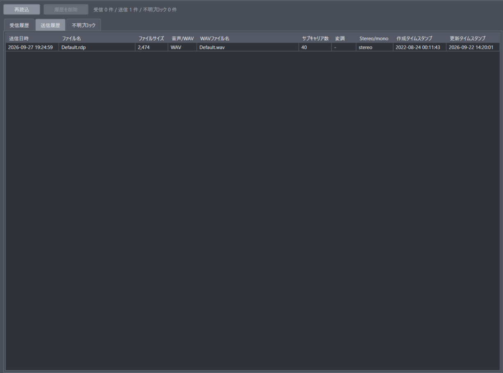
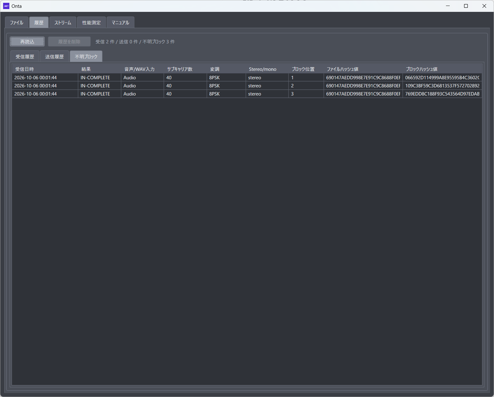

# 3. 履歴画面の説明

## 3.1 履歴画面の目的

履歴画面では、過去の送受信結果を一覧で確認できます。
再実行時の設定確認や、受信結果の追跡に利用します。

## 3.2 画面上部の操作

- 再読込: 履歴データを再読み込みします。
- 履歴を削除: 履歴情報を削除します。

注記: 削除後は元に戻せない運用を想定しているため、実施前に確認を推奨します。

## 3.3 受信履歴タブ

### 3.3.1 確認できる情報

- 受信日時
- ファイル名
- ファイルサイズ
- 結果
- ブロック数
- 音声/WAV
- WAVファイル名
- 作成タイムスタンプ
- 更新タイムスタンプ

### 3.3.2 受信履歴の操作

- 受信日時をクリックすると、ブロック明細を開閉できます。
- ファイルヘッダーを受けずにブロックだけ受信し、そのファイルが受信履歴に無い場合（親のいないブロック）は、受信履歴には載らず不明ブロックタブに載ります。後からそのファイルのファイルヘッダーを受信すると、不明ブロックが受信履歴の明細に移ります。
- 条件を満たした行では「ダウンロード」ボタンが表示されます。

### 3.3.3 受信履歴明細

受信日時をクリックすると、そのファイルのブロックごとの受信結果が行の下に開きます。もう一度クリックすると閉じます。

| 項目           | 内容                                                                                          |
| :------------- | :-------------------------------------------------------------------------------------------- |
| BLK            | ブロック番号（0 始まり）。番号順に並びます                                                    |
| 結果           | OK: データまで受信できたブロック / NG: ブロックヘッダーは読めたが、データが壊れていたブロック |
| サブキャリア数 | そのブロックのデータ部のサブキャリア数（16〜72）                                              |
| 変調           | そのブロックのデータ部の変調方式（BPSK / QPSK / 8PSK / 16QAM / 64QAM）                        |
| Stereo/mono    | そのブロックのチャンネル（stereo / mono）                                                     |
| ブロックサイズ | ブロックのバイト数。最大 16,384 で、最後のブロックだけ短くなります                            |

- サブキャリア数・変調・Stereo/mono は、そのブロックについて最後に読んだブロックヘッダーの値です。Interleave x2 で送ったファイルを 2 回目の記録まで受信すると、2 回目に下げた設定（16 サブキャリアなど）が表示されます。
- 明細に出るのは、受信できたブロック（OK と NG）だけです。ブロックヘッダーも読めなかったブロックは行が出ないので、BLK の番号が飛びます。
- 同じファイルを受信し直すと、明細は前回分とまとめて 1 件になります。NG だったブロックが OK で受信できると OK に置き換わり、OK のブロックが後から NG に戻ることはありません。
- 全ブロック（0〜ブロック数−1）が OK になると、結果が COMPLETE になり、「ダウンロード」でファイルを取り出せます。
- 最初にファイルヘッダーを受けずに受信した不明ブロックは、あとで同じファイルのファイルヘッダーを受信すると、この明細に移ります。

## 3.4 送信履歴タブ

### 3.4.1 確認できる情報

- 送信日時
- ファイル名
- ファイルサイズ
- 音声/WAV
- WAVファイル名
- サブキャリア数
- 変調
- Stereo/mono
- 作成タイムスタンプ
- 更新タイムスタンプ

送信条件の再確認や、過去の送信設定比較に利用できます。

## 3.5 不明ブロックタブ

### 3.5.1 確認できる情報

- 受信日時
- 結果
- 音声/WAV入力
- サブキャリア数
- 変調
- Stereo/mono
- ブロック位置
- ファイルハッシュ値
- ブロックハッシュ値

このタブは、復元先に紐づけできなかったブロック情報の確認に使います。

- ファイルハッシュ値はファイル全体、ブロックハッシュ値はそのブロックの SHA-256（16 進 64 桁）です。

- 結果は、データまで受信できたブロックが COMPLETE、ブロックヘッダーだけ読めてデータが壊れていたブロックが IN-COMPLETE です。
- 不明ブロックは受信するたびに蓄積されます。ブロック位置・ファイルハッシュ・ブロックハッシュが同じブロックは 1 件として扱い、受信日時は新しい方になります。
- そのファイルのファイルヘッダーを受信すると、ファイルハッシュが同じ不明ブロックは受信履歴へ移り、このタブから消えます。すでに受信済み（完了したブロックがある）のものも消えます。
- 「履歴を削除」で、選んだ不明ブロックだけを削除できます。

## 3.6 履歴画面の活用例

1. 受信失敗時に、受信履歴タブの結果とブロック数を確認する
2. 不明ブロックタブで失敗傾向を確認する
3. 送信履歴タブで送信時の変調・サブキャリア設定を照合する
